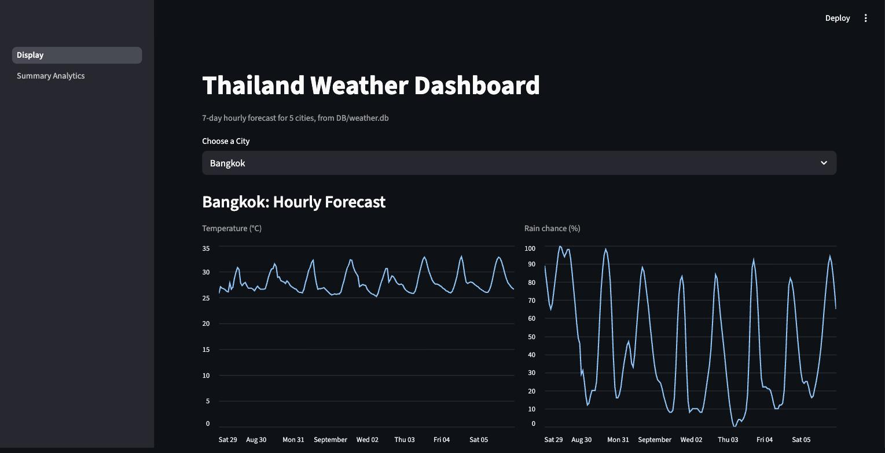
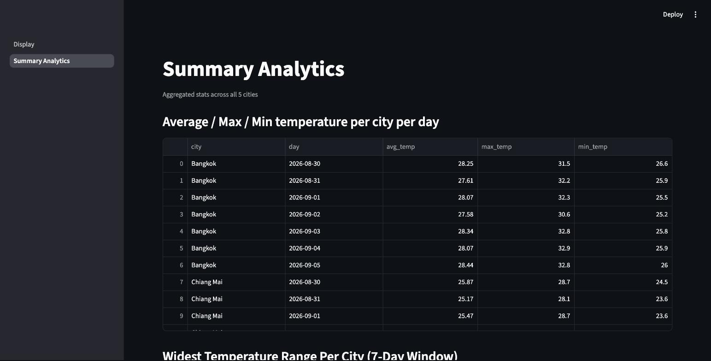

# Thailand Weather Data Pipeline

A small ETL pipeline that pulls a 7-day hourly forecast for 5 Thai cities from
[Open-Meteo](https://open-meteo.com/) (free, no signup, no API key), loads it
into SQLite, and displays it with a Streamlit dashboard.

**Cities:** Bangkok, Chiang Mai, Phuket, Khon Kaen, Hat Yai
**API:** Open-Meteo forecast endpoint — used as recommended; free and keyless,
which is all this needs.
**Live app:** https://city-weather-report.streamlit.app/ — deployed on
Streamlit Community Cloud from this repo. Note: the deployed app serves
whatever `DB/weather.db` was committed at deploy time; it doesn't run
`ReadyAPI.py` on a schedule, so the data is a snapshot rather than
continuously refreshed (see "What I'd change for hourly-forever operation"
below).

## Project layout

```
ReadyAPI.py               # ingestion: fetch -> raw store -> transform -> load
Schema/schema.sql          # DB schema (SQLite)
DB/weather.db               # SQLite database (created/updated by ReadyAPI.py)
Display.py                  # Streamlit app: per-city hourly charts
pages/1_Summary_Analytics.py# Streamlit page: the 4 required analyses
SQL/queries.sql              # the same 4 analyses as raw SQL
SQL/results.md                # captured output of SQL/queries.sql
logs/fetch.log                # ingestion run log
requirements.txt
```

## Running it

```bash
python3 -m venv .venv && source .venv/bin/activate
pip install -r requirements.txt

python3 ReadyAPI.py              # ingest: fetch + load into DB/weather.db
streamlit run Display.py         # display: reads DB/weather.db, never the API
```

`ReadyAPI.py` only needs the Python standard library (`urllib`, `sqlite3`,
`json`, `logging`) — `requirements.txt` covers the Streamlit display layer.

## Screenshots

**Dashboard** — per-city hourly temperature and rain-chance charts, read from `DB/weather.db`:



**Summary Analytics** — the 4 required aggregate queries, rendered from the same DB:



## SQL

The four required analyses are in [`SQL/queries.sql`](SQL/queries.sql) as plain
SQL (SQLite dialect, including two window-function queries), with their actual
output captured in [`SQL/results.md`](SQL/results.md). All four filter to the
current 7-day forecast window — see "Idempotency" below for why the table can
otherwise hold more than 7 days of data. The Streamlit "Summary Analytics"
page above re-implements the same four analyses in pandas for the display
layer — both are included since the assignment asks for SQL queries+results
as a distinct deliverable from the display.

---

## Design summary

### Schema — why two tables, why these keys

`raw_responses` and `weather` (see `Schema/schema.sql`). I split them because
they answer different questions and change at different rates:

- **`raw_responses`** is the untransformed API response body, one row per
  `(city, run_date)`. It exists purely so a bad transform can be replayed
  without re-hitting the API, and so I can prove what the API actually
  returned on a given day. Its unique key is `(city, run_date)` — one fetch
  per city per calendar day is all this assignment needs, so re-running the
  script the same day overwrites that day's raw copy instead of piling up
  near-identical JSON blobs.
- **`weather`** is the transformed, query-ready hourly table: `city, time,
  temperature, precipitation_probability`. Its unique key is `(city, time)` —
  that's the natural grain of an hourly forecast, and it's what makes the
  upsert (see below) work. I didn't split city into its own dimension table
  (e.g. a `cities` table with lat/lon) because there are only 5, fixed at
  the top of `ReadyAPI.py`, and a join would add a moving part for no benefit
  at this scale — worth revisiting if the city list became dynamic.

### Idempotency

Both tables use `INSERT ... ON CONFLICT DO UPDATE` (upsert) against their
unique keys, and each city's fetch+write happens inside one SQLite
transaction that's rolled back on any error. So running the script 3 times in
a row:

- overwrites the same `(city, run_date)` raw row and the same `(city, time)`
  weather rows — no duplicate rows, no growing counts;
- never leaves a half-written city: either a city's whole transaction commits
  or none of it does.

I verified this directly: 3 consecutive runs on the same day held steady at
840 total weather rows (168 × 5 cities); see `logs/fetch.log`.

One nuance worth calling out: because the forecast window is "today .. today+6"
and *re-fetched daily*, running the script on a **different day** does add new
rows — the window shifts forward by a day, so yesterday's now-stale hours stay
in the table (nothing deletes them) while a new day's hours get inserted. This
is deliberate: it turns the table into a growing historical record instead of
a pure rolling snapshot, at the cost of the table not staying at a fixed size.
The SQL analyses in `SQL/queries.sql` filter to the current 7-day window so
they reflect "the current forecast," not the accumulated history.

### Data issues from the API

- **Timezone**: the API defaults to UTC unless asked otherwise, which would
  make "per day" boundaries meaningless for cities that are UTC+7. The
  ingestion script explicitly requests `timezone=Asia/Bangkok`, so `time`
  values in the DB are already local and day boundaries line up with what a
  person in Thailand would expect.
- **Units**: Open-Meteo returns temperature in °C and precipitation
  probability as a 0–100 percentage by default, which matches what the
  assignment expects — no conversion needed.
- **Nulls**: `weather.precipitation_probability` is nullable (unlike
  `temperature`, which is `NOT NULL`) because Open-Meteo can in principle omit
  it for an hour; none of the runs so far actually hit this, but the column
  and the load path tolerate it rather than assuming it's always present.
- **Shape/failure handling**: `process_city` validates that `hourly.time`,
  `hourly.temperature_2m`, and `hourly.precipitation_probability` are all
  present and the same length before writing anything — an unexpected
  response shape raises and is logged as a per-city failure rather than
  writing partial or misaligned rows. Network failures get 3 attempts with
  backoff before being logged as failed; one city failing doesn't stop the
  others (see the tested `BrokenCity` failure in `logs/fetch.log`, run
  continued with 4/5 succeeding elsewhere in history).
- **Gaps**: none observed in practice — every run so far returned exactly the
  requested 168 hours (7 × 24) per city.

### What I'd change for hourly-forever operation

- Stop keeping every historical hour forever in `weather` (see the growth
  note above) — add a retention window or an `is_forecast`/`observed` split
  so the table doesn't grow unbounded over a year of hourly runs.
- Move from SQLite to Postgres/MySQL — SQLite's single-writer-at-a-time model
  is fine for a daily batch script but would contend with itself or a
  dashboard under hourly concurrent writes.
- Add alerting on repeated per-city failures instead of just logging them —
  right now a city failing silently produces stale data until someone reads
  `fetch.log`.
- Make the run idempotent per **hour** rather than per **day**: `run_date` in
  `raw_responses` would need to become a timestamp key, since "one raw
  response per city per day" stops being meaningful once you're fetching
  every hour.
- Add a scheduler (cron/Airflow) with a lock so overlapping runs (e.g. a slow
  run still in flight when the next hour fires) can't interleave writes.

### Insights

- **Hat Yai has by far the widest 7-day temperature swing** (12.5°C, from
  24.2°C to 36.0°C) — noticeably more than the other four cities, which all
  sit in a tighter 6–8°C band. As a coastal city its daytime peak is higher
  than the others' while its overnight low is comparable, giving it the
  biggest day/night delta rather than the highest average.
- **Chiang Mai is both the coolest city on average and the rainiest** — it
  has the lowest daily average temperatures of the 5 (~25–26°C, vs. ~27–29°C
  elsewhere) and repeatedly hits 100% precipitation probability across
  several consecutive hours on multiple days, consistent with it being
  inland/mountainous versus the drier coastal profile of, say, Hat Yai on the
  same days.

### AI tool usage

This session used Claude Code (Anthropic) to: find and fix a bug where
`ReadyAPI.py` pointed at `schema.sql` and write this README. The ingestion script,
schema, and Streamlit pages predate this session — adjust this section 
if you want to describe how those were built.
